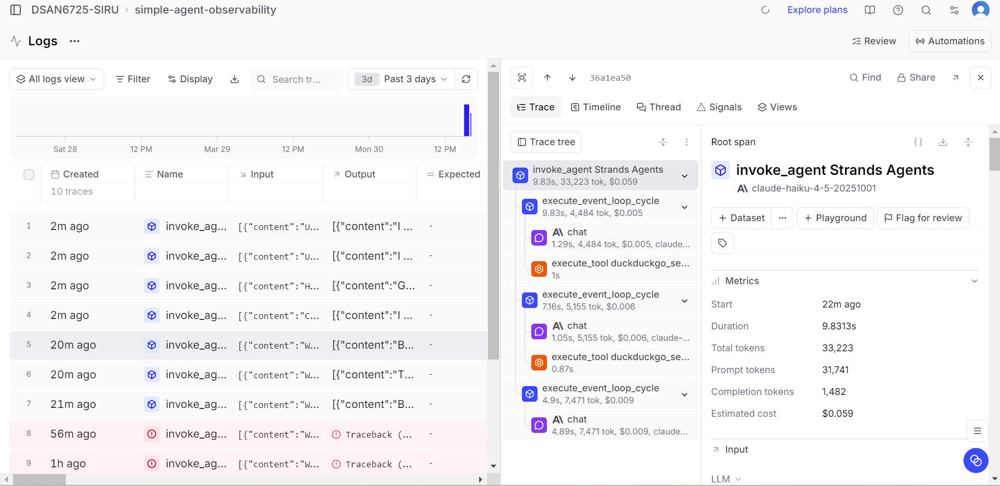

# MCP Observability Analysis

*Screenshot showing MCP tool invocation in Braintrust trace.*

I connected the agent to the Context7 MCP server and loaded its documentation tools using the MCPClient with streamable HTTP transport. The tools available include functions like `resolve-library-id` and `query-docs`, which are used to retrieve structured documentation.

In the Braintrust trace, I observed that the agent invoked the MCP tool `query-docs` when answering a question about FastAPI. This tool call appears as a separate span in the trace, similar to other tool calls. Compared to DuckDuckGo, which is used for general web search, the MCP tools are more focused on retrieving specific documentation. This makes them more suitable for programming-related questions where structured information is needed.